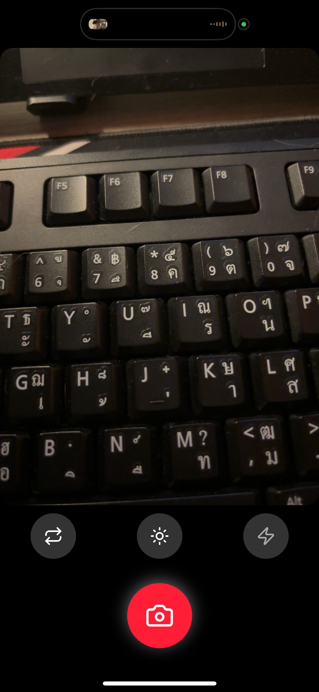
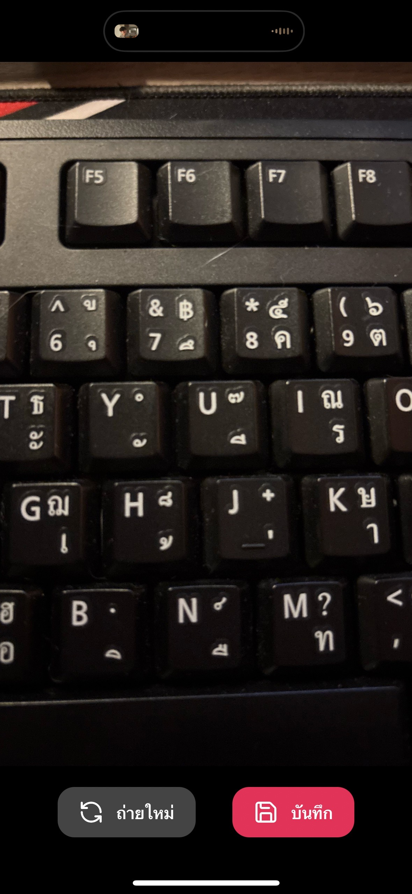

 Camera App 📸

แอปถ่ายรูปสำหรับมือถือที่สร้างด้วย **React Native + Expo**  
สามารถถ่ายรูป, ถ่ายใหม่, บันทึกรูปลงอัลบั้ม, สลับกล้องหน้า/หลัง และเปิด/ปิดแฟลช/ไฟฉายได้  

---

## ⚡ คุณสมบัติ
- ปุ่ม **ถ่ายรูป** ขนาดใหญ่ พร้อมไอคอนกล้อง
- ปุ่ม **ถ่ายใหม่ / บันทึก** หลังจากถ่ายเสร็จ
- ปุ่ม **สลับกล้อง** (หน้า/หลัง)
- ปุ่ม **แฟลช** สลับ Off / On / Auto
- ปุ่ม **ไฟฉาย** สำหรับกล้องหลัง
- ดีไซน์ปุ่มทันสมัย พร้อมไอคอนจาก `lucide-react-native`

---

## 

### หน้า Camera


### หลังจากถ่ายรูป


---

## 🛠 การติดตั้ง

1. Clone โปรเจกต์
```bash
git clone https://github.com/Sanruethai/camera-app.git
cd camera-app
