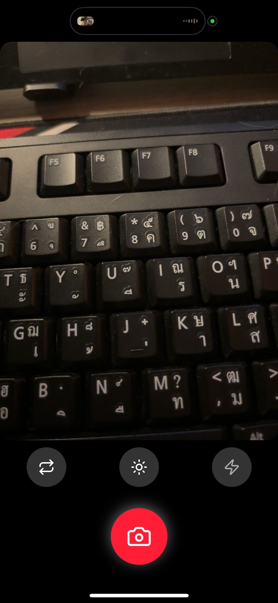

 Camera App 📸

แอปถ่ายรูปสำหรับมือถือที่สร้างด้วย **React Native + Expo**  
สามารถถ่ายรูป, ถ่ายใหม่, บันทึกรูปลงอัลบั้ม, สลับกล้องหน้า/หลัง และเปิด/ปิดแฟลช/ไฟฉายได้  

---

## ⚡ คุณสมบัติ
- ปุ่ม **ถ่ายรูป** ขนาดใหญ่ พร้อมไอคอนกล้อง
- ปุ่ม **ถ่ายใหม่ / บันทึก** หลังจากถ่ายเสร็จ
- ปุ่ม **สลับกล้อง** (หน้า/หลัง)
- ปุ่ม **แฟลช** สลับ Off / On / Auto
- ปุ่ม **ไฟฉาย** สำหรับกล้องหลัง
- ดีไซน์ปุ่มทันสมัย พร้อมไอคอนจาก `lucide-react-native`
- 
### การใช้งาน

เปิดแอป → หน้า Home Screen

กดปุ่ม Camera เพื่อถ่ายภาพ

กดปุ่ม Gallery เพื่อดูภาพที่บันทึกไว้

สามารถสลับโหมดกล้องหน้า/หลัง และดู Preview ก่อนบันทึกภาพ
---

##

### หน้า Camera



### หลังจากถ่ายรูป


### อัลบั้ม


---

## 🛠 การติดตั้ง

1. Clone โปรเจกต์
```bash
git clone https://github.com/Sanruethai/camera-app.git
cd camera-app


โครงสร้างโฟลเดอร์
camera-app/
│
├── assets/            # รูปภาพและสื่อประกอบ
├── src/
│   ├── components/    # คอมโพเนนต์ต่าง ๆ ของแอป
│   ├── screens/       # หน้าจอต่าง ๆ
│   └── App.js         # จุดเริ่มต้นของแอป
│
├── package.json
└── README.md
